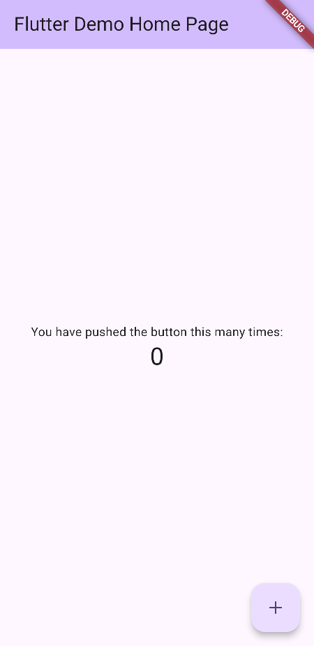

# Aplikasi Pertama (Counter)

Setiap kali membuat projek Flutter baru, Flutter akan otomatis menyajikan aplikasi bawaan berupa aplikasi penghitung sederhana (*counter app*).

Berikut adalah contoh struktur dasar **Counter App** yang otomatis dibuat saat inisialisasi projek:

```dart
import 'package:flutter/material.dart';

void main() {
  runApp(const MyApp());
}

class MyApp extends StatelessWidget {
  const MyApp({super.key});

  @override
  Widget build(BuildContext context) {
    return MaterialApp(
      title: 'Flutter Demo',
      theme: ThemeData(colorScheme: .fromSeed(seedColor: Colors.deepPurple)),
      home: const MyHomePage(title: 'Flutter Demo Home Page'),
    );
  }
}

class MyHomePage extends StatefulWidget {
  const MyHomePage({super.key, required this.title});

  final String title;

  @override
  State<MyHomePage> createState() => _MyHomePageState();
}

class _MyHomePageState extends State<MyHomePage> {
  int _counter = 0;

  void _incrementCounter() {
    setState(() {
      _counter++;
    });
  }

  @override
  Widget build(BuildContext context) {
    return Scaffold(
      appBar: AppBar(
        backgroundColor: Theme.of(context).colorScheme.inversePrimary,
        title: Text(widget.title),
      ),
      body: Center(
        child: Column(
          mainAxisAlignment: .center,
          children: [
            const Text('You have pushed the button this many times:'),
            Text(
              '$_counter',
              style: Theme.of(context).textTheme.headlineMedium,
            ),
          ],
        ),
      ),
      floatingActionButton: FloatingActionButton(
        onPressed: _incrementCounter,
        tooltip: 'Increment',
        child: const Icon(Icons.add),
      ),
    );
  }
}
```
## Membedah Kode Utama

Kode utama aplikasi selalu berada di dalam `lib/main.dart`. Mari kita bedah satu per satu setiap bagiannya:

### 1. Import
Perintah ini digunakan untuk memanggil seluruh komponen antarmuka standar (*Material Design*) yang disediakan oleh Flutter. Tanpa baris ini, kamu tidak bisa membuat *widget* apapun.

```dart
import 'package:flutter/material.dart';
```

### 2. Fungsi `main()`
Ini adalah pintu gerbang utama dari aplikasimu. Saat aplikasi pertama kali dijalankan, kode di dalam fungsi `main()` inilah yang akan dieksekusi. Fungsi `runApp()` bertugas untuk menampilkan antarmuka aplikasi.

```dart
void main() {
  runApp(const MyApp());
}
```

### 3. Class `MyApp`
Ini adalah kerangka atau pembungkus utama aplikasimu. Karena tidak memiliki data yang berubah (statis), kelas ini menggunakan `StatelessWidget`. Di dalamnya, `MaterialApp` bertugas mengatur warna dasar aplikasi dan menentukan halaman pertama yang akan muncul.

```dart
class MyApp extends StatelessWidget {
  const MyApp({super.key});

  @override
  Widget build(BuildContext context) {
    return MaterialApp(
      title: 'Flutter Demo',
      theme: ThemeData(colorScheme: .fromSeed(seedColor: Colors.deepPurple)),
      home: const MyHomePage(title: 'Flutter Demo Home Page'),
    );
  }
}
```

### 4. Class `MyHomePage`
Karena halaman ini memiliki komponen yang bisa berubah (yaitu angka yang bertambah setiap tombol ditekan), kita harus menggunakan `StatefulWidget`. Kelas ini hanya bertugas mendaftarkan komponen awal, sedangkan data dinamisnya dikelola di kelas berikutnya.

```dart
class MyHomePage extends StatefulWidget {
  const MyHomePage({super.key, required this.title});

  final String title;

  @override
  State<MyHomePage> createState() => _MyHomePageState();
}
```

### 5. State (Data yang Berubah)
Kelas `_MyHomePageState` adalah pasangan dari `MyHomePage`. Kelas inilah yang menyimpan data (seperti `_counter`) dan memiliki fungsi `_incrementCounter()` untuk mengubah nilai tersebut menggunakan perintah `setState()`. Saat `setState()` dipanggil, tampilan akan secara otomatis diperbarui.

```dart
class _MyHomePageState extends State<MyHomePage> {
  int _counter = 0;

  void _incrementCounter() {
    setState(() {
      _counter++;
    });
  }
  
  // ...
}
```

### 6. Fungsi `build()`
Setiap *widget* wajib memiliki fungsi `build()`. Di sinilah kamu menggambar tampilan layarnya menggunakan kumpulan *widget* lain seperti `Scaffold` (kerangka layar), `AppBar` (bilah atas), `Text` (teks), dan `FloatingActionButton` (tombol aksi melayang).

```dart
  @override
  Widget build(BuildContext context) {
    return Scaffold(
      appBar: AppBar(
        backgroundColor: Theme.of(context).colorScheme.inversePrimary,
        title: Text(widget.title),
      ),
      body: Center(
        child: Column(
          mainAxisAlignment: .center,
          children: [
            const Text('You have pushed the button this many times:'),
            Text(
              '$_counter',
              style: Theme.of(context).textTheme.headlineMedium,
            ),
          ],
        ),
      ),
      floatingActionButton: FloatingActionButton(
        onPressed: _incrementCounter,
        tooltip: 'Increment',
        child: const Icon(Icons.add),
      ),
    );
  }
```

## Kesimpulan

Aplikasi **Counter App** adalah contoh yang tepat untuk memahami cara kerja Flutter. Dengan menggabungkan `StatelessWidget` sebagai kerangka dasar dan `StatefulWidget` untuk menangani perubahan data yang interaktif, kamu telah memiliki fondasi penting untuk membuat aplikasi *mobile*.

Berikut adalah hasil tampilan aplikasinya saat dijalankan:

<div>
  
</div>