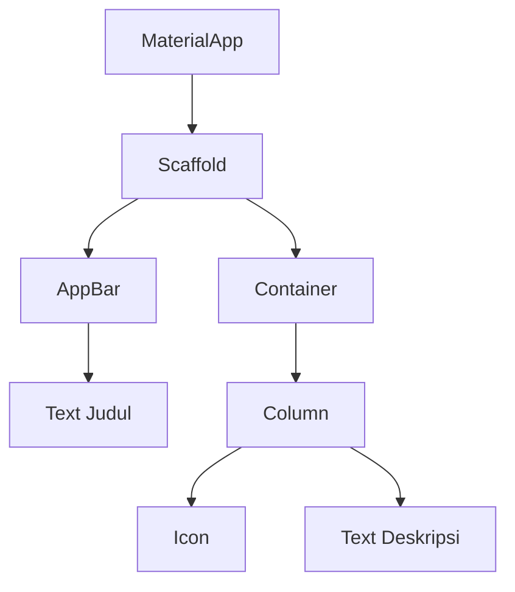

# Pengenalan Widget

Dalam pengembangan aplikasi dengan Flutter, ada satu prinsip dasar yang wajib kamu ingat: **Segalanya adalah Widget** (*Everything is a Widget*).

**Analogi:** Bayangkan kamu sedang bermain balok Lego. Untuk membuat rumah Lego, kamu membutuhkan balok kecil penyusunnya seperti balok pintu, balok jendela, dan balok atap. Di Flutter, **Widget** adalah balok-balok Lego tersebut. 

Teks yang kamu baca di layar, tombol yang kamu tekan, gambar profil, bahkan jarak kosong antar elemen, semuanya dibuat menggunakan *widget*.

## Pohon Widget (Widget Tree)

Karena aplikasi Flutter disusun dengan menggabungkan banyak *widget*, struktur akhirnya akan menyerupai susunan pohon (cabang-bercabang) yang disebut **Widget Tree**.

- **Widget Induk (Parent)**: *Widget* utama yang membungkus elemen lain.
- **Widget Anak (Child/Children)**: *Widget* kecil yang berada di dalam *widget* induk.

Contoh sederhana: *Widget* `Container` (sebagai kotak/induk) membungkus *widget* `Text` (teks di dalamnya/anak). Jika digambarkan secara visual, struktur percabangannya akan terlihat seperti ini:

Dengan menggabungkan berbagai macam balok *widget* kecil ini secara kreatif, kamu bisa membangun tampilan antarmuka yang sangat kompleks dan menarik. Di materi selanjutnya, kita akan membedah dua keluarga besar dari *widget*, yaitu *Stateless* dan *Stateful*.
