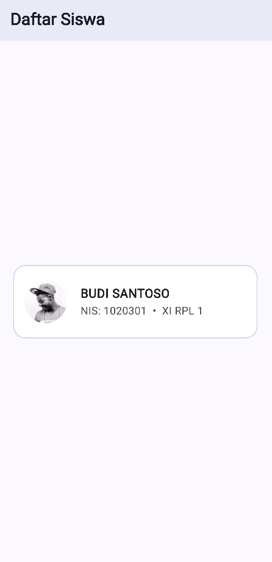

# Studi Kasus 1: Daftar Siswa

Sekarang saatnya kita membuat desain dasar **Aplikasi Daftar Siswa** dengan gaya yang lebih modern dan minimalis. Kita akan menggunakan komponen `Card`, `ListTile`, dan `CircleAvatar`.

**Analogi:** Bayangkan kita sedang mendesain daftar nama yang modern. Kita butuh komponen utama (*Card*), baris konten praktis (*ListTile*) untuk menempatkan foto di sebelah kiri secara otomatis, dan bingkai foto berbentuk lingkaran (*CircleAvatar*).

## Rancangan Layout

- **Komponen Utama (*Card*)**: Menggunakan latar belakang putih bersih dengan garis tepi (*border*) tipis berwarna *indigo* (nila) lembut dan sudut melengkung.
- **Sisi Kiri (*Leading*)**: Menampilkan foto profil siswa dalam bingkai bulat.
- **Teks Utama (*Title*)**: Menampilkan Nama siswa dengan huruf tebal.
- **Teks Pendukung (*Subtitle*)**: Menampilkan gabungan NIS dan Kelas di bawah nama.

## Kode Implementasi

Silakan salin kode berikut ke dalam `lib/main.dart` kamu:

```dart
import 'package:flutter/material.dart';

void main() {
  runApp(const AplikasiDaftarSiswa());
}

class AplikasiDaftarSiswa extends StatelessWidget {
  const AplikasiDaftarSiswa({super.key});

  @override
  Widget build(BuildContext context) {
    return MaterialApp(
      debugShowCheckedModeBanner: false,
      theme: ThemeData(
        colorScheme: ColorScheme.fromSeed(seedColor: Colors.indigo),
        useMaterial3: true,
      ),
      home: Scaffold(
        appBar: AppBar(
          title: const Text(
            'Daftar Siswa',
            style: TextStyle(fontWeight: FontWeight.bold),
          ),
          backgroundColor: Colors.indigo.shade50,
        ),
        // Kita gunakan Center agar daftar berada di tengah layar
        body: Center(
          child: Padding(
            padding: const EdgeInsets.all(16.0),
            child: Card(
              elevation: 0,
              color: Colors.white,
              shape: RoundedRectangleBorder(
                borderRadius: BorderRadius.circular(16),
                side: BorderSide(color: Colors.indigo.shade100),
              ),
              child: ListTile(
                contentPadding: const EdgeInsets.all(12),
                leading: const CircleAvatar(
                  radius: 30,
                  backgroundImage: AssetImage('assets/profile.jpg'),
                ),
                title: const Text(
                  'BUDI SANTOSO',
                  style: TextStyle(fontWeight: FontWeight.bold, fontSize: 16),
                ),
                subtitle: const Text('NIS: 1020301  •  XI RPL 1'),
              ),
            ),
          ),
        ),
      ),
    );
  }
}
```

Coba jalankan (*run*) kode di atas. Dengan susunan komponen *Widget* ini, kamu sudah berhasil membuat tampilan identitas yang tampak seperti daftar siswa profesional!

<div>
  
</div>