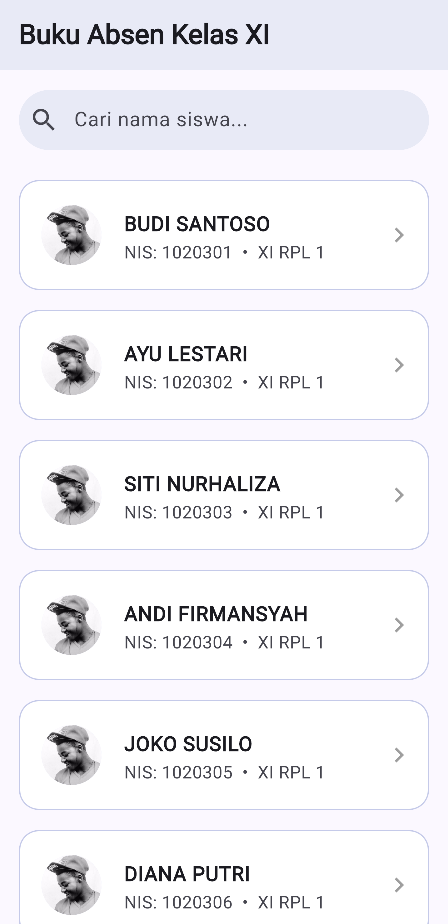

# Studi Kasus Akhir: Aplikasi Daftar Siswa Lengkap

Inilah waktunya untuk menyatukan **seluruh** materi yang telah kamu pelajari di bab ini. Kita akan mengembangkan aplikasi "Buku Absen Kelas XI" dengan mengintegrasikan tema terpusat (`ThemeData`), kolom input pencarian interaktif (`TextField`), daftar bergulir yang efisien (`ListView.builder`), serta perpindahan halaman layaknya aplikasi asli (`Navigator.push`).

## Rancangan Layout Puncak

1. **Tema Global**: Menggunakan warna dasar `Colors.indigo` yang konsisten di seluruh aplikasi melalui `ThemeData`.
2. **Search Bar**: Di bagian atas daftar, kita sediakan satu `TextField` berujung melengkung untuk fitur pencarian agar terkesan seperti aplikasi sungguhan.
3. **Daftar Data Siswa**: Di bawah pencarian, kita gelar daftar siswa bergaya modern menggunakan `ListView.builder` (wajib dibungkus `Expanded` agar daftarnya tidak *overflow* ke bawah layar).
4. **Interaksi ListTile**: Setiap baris data memanfaatkan properti `onTap` pada `ListTile` dan dilengkapi ikon panah (*trailing*).
5. **Navigasi Halaman**: Saat baris data diklik, aplikasi akan menggunakan fungsi `Navigator.push` untuk melempar layar ke halaman profil detail siswa yang bersangkutan.

## Kode Implementasi Total

Salin dan ganti kode secara utuh pada `lib/main.dart` kamu. 
*(Pastikan gambar `assets/profile.jpg` di `pubspec.yaml` tidak dihapus dan sudah terpasang dengan benar).*

```dart
import 'package:flutter/material.dart';

void main() => runApp(const AplikasiAbsenSiswa());

class AplikasiAbsenSiswa extends StatelessWidget {
  const AplikasiAbsenSiswa({super.key});

  @override
  Widget build(BuildContext context) {
    return MaterialApp(
      debugShowCheckedModeBanner: false,
      title: 'Buku Absen',
      theme: ThemeData(
        colorScheme: ColorScheme.fromSeed(seedColor: Colors.indigo),
        useMaterial3: true,
      ),
      home: const HalamanDaftarSiswa(),
    );
  }
}

class HalamanDaftarSiswa extends StatefulWidget {
  const HalamanDaftarSiswa({super.key});

  @override
  State<HalamanDaftarSiswa> createState() => _HalamanDaftarSiswaState();
}

class _HalamanDaftarSiswaState extends State<HalamanDaftarSiswa> {
  final List<String> semuaSiswa = [
    'BUDI SANTOSO', 'AYU LESTARI', 'SITI NURHALIZA',
    'ANDI FIRMANSYAH', 'JOKO SUSILO', 'DIANA PUTRI',
  ];
  List<String> siswaDitampilkan = [];

  @override
  void initState() {
    super.initState();
    siswaDitampilkan = semuaSiswa;
  }

  void cariSiswa(String teks) {
    setState(() {
      siswaDitampilkan = teks.isEmpty
          ? semuaSiswa
          : semuaSiswa.where((n) => n.toLowerCase().contains(teks.toLowerCase())).toList();
    });
  }

  @override
  Widget build(BuildContext context) {
    return Scaffold(
      appBar: AppBar(
        title: const Text(
          'Buku Absen Kelas XI',
          style: TextStyle(fontWeight: FontWeight.bold),
        ),
        backgroundColor: Colors.indigo.shade50,
      ),
      body: Column(
        children: [
          // 1. Kotak Pencarian
          Padding(
            padding: const EdgeInsets.all(16.0),
            child: TextField(
              onChanged: cariSiswa,
              decoration: InputDecoration(
                hintText: 'Cari nama siswa...',
                prefixIcon: const Icon(Icons.search),
                filled: true,
                fillColor: Colors.indigo.shade50,
                border: OutlineInputBorder(
                  borderRadius: BorderRadius.circular(30),
                  borderSide: BorderSide.none,
                ),
              ),
            ),
          ),
          
          // 2. Daftar Siswa
          Expanded(
            child: ListView.builder(
              itemCount: siswaDitampilkan.length,
              itemBuilder: (context, index) {
                return Card(
                  margin: const EdgeInsets.symmetric(horizontal: 16, vertical: 8),
                  elevation: 0,
                  color: Colors.white,
                  shape: RoundedRectangleBorder(
                    borderRadius: BorderRadius.circular(16),
                    side: BorderSide(color: Colors.indigo.shade100),
                  ),
                  child: ListTile(
                    contentPadding: const EdgeInsets.all(12),
                    leading: const CircleAvatar(
                      radius: 30,
                      backgroundImage: AssetImage('assets/profile.jpg'),
                    ),
                    title: Text(
                      siswaDitampilkan[index],
                      style: const TextStyle(fontWeight: FontWeight.bold, fontSize: 16),
                    ),
                    subtitle: Text('NIS: 102030${index + 1}  •  XI RPL 1'),
                    trailing: const Icon(Icons.chevron_right, color: Colors.grey),
                    onTap: () {
                      Navigator.push(
                        context,
                        MaterialPageRoute(
                          builder: (context) => HalamanDetailSiswa(
                            namaSiswa: siswaDitampilkan[index],
                          ),
                        ),
                      );
                    },
                  ),
                );
              },
            ),
          ),
        ],
      ),
    );
  }
}

class HalamanDetailSiswa extends StatelessWidget {
  final String namaSiswa;
  
  const HalamanDetailSiswa({super.key, required this.namaSiswa});

  @override
  Widget build(BuildContext context) {
    return Scaffold(
      appBar: AppBar(
        title: const Text('Profil Siswa'),
        backgroundColor: Colors.indigo.shade50,
      ),
      body: Center(
        child: Column(
          mainAxisAlignment: MainAxisAlignment.center,
          children: [
            const CircleAvatar(
              radius: 60,
              backgroundImage: AssetImage('assets/profile.jpg'),
            ),
            const SizedBox(height: 24),
            Text(
              namaSiswa,
              style: const TextStyle(fontSize: 24, fontWeight: FontWeight.bold),
            ),
            const SizedBox(height: 8),
            const Text(
              'Siswa Kelas XI RPL 1',
              style: TextStyle(fontSize: 16, color: Colors.grey),
            ),
          ],
        ),
      ),
    );
  }
}
```

<div>
  
</div>

Selamat! Mahakaryamu telah selesai. Kamu telah sukses merangkai secara utuh seluruh serpihan ilmu *Widget Dasar* Flutter (dari tata letak, gambar, fon, interaksi tombol, hingga perpindahan layar) menjadi satu aplikasi simulasi yang interaktif, rapi, canggih, dan tidak mudah rusak!

